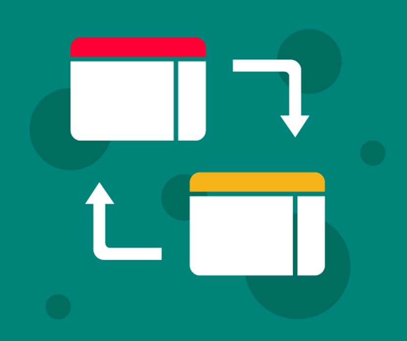

# Practical guidance on how to implement a re-platform{#practical}

Once you have determined that your model should be ported into a code-based format there are a number of things you should plan and consider as you start to scope your project.  We'll provide some general guidance here with further practical tips in the [case studies](#case_studies) section.

## Pre-requisites

To ensure a successful outcome, you will need to address the following areas before beginning re-platforming:

* Secure **buy-in from stakeholders**.
  + See [this](#stakeholder) section for some of the most commonly asked questions from Stakeholders. Make sure to engage with them early as this could be one of the most difficult challenges.

* Identify **end users**.
  + Are they analysts? Managers? Policy stakeholders? A combination of all of those?
  + Identifying end users will influence the language you use and the output(s) you decide to create.
  + Thinking about this prior to re-platforming will enable you to shape the redevelopment in the best way.

:::: {.infoboxred .exclamation data-latex="exclamation"}

What impact will the re-platforming have on end-users? Will they be find using the model easier? Quicker? Will there be more functionality? Most importantly - are you making things better?

::::

* Ensure there is **sufficient time and appropriate resource**.
  + A rushed job is more likely to be a poor job. You may have to postpone Business As Usual work, postpone existing model updates or secure additional resource.
  + However tempting it might be to 'contract out' the re-platforming to experts who then hand it over, this is *not* recommended. Without _a lot_ of collaboration, you're likely to end up with a team who do not understand the model.
  + The analysts who will carry out the re-platform need to have sufficient software knowledge for the chosen platform. This might mean they need to undertake L&D activities and/or engage with experts and relevant groups for advice and support (for example, the DfE Analyst Network Data Science channel or Python Team).

## Design choices

**Language**

You will need to choose a language that allows you to deliver the required outputs but also one with which your team have the skills to code in, or the ability to learn.  Within DfE, SQL is already well established, whilst R is becoming increasing popular and is very well supported with [Analytics Academy](https://educationgovuk.sharepoint.com/sites/sarpi/g/SitePages/Analytics-Academy.aspx) and a number of willing experts across the Department who regularly provide support and advice through the DfE Analyst Network.  Python may also be a consideration and whilst it is not (yet) as popular as R within DfE there is an active community and plenty of external resources online.

**Code design**

As with lots of code-based analysis, it is likely that the code design will evolve as the re-platform commences. Having a clear set of objectives and required outputs will also help to avoid scope creep and reduce the likelihood of the re-platformed model becoming unnecessarily complex.

**Clarity**

The re-platformed model should be structured so that it's efficient and follows best practice.  In fact, you may specifically want to avoid replicating the existing processes and mechanics of the non-code based model in order to improve the efficiency of the re-platformed model.

:::: {.infoboxblue .info data-latex="info"}

The benefits of writing clear code are covered [here](https://dfe-analytical-services.github.io/good-code-practice/fundamentals.html). For a re-platforming model, the requirements for code-writing are the same - code must be well-structured, consistent and commented appropriately.

::::

Depending on the complexity of the model, it may be beneficial to provide a schematic diagram of how the model works, such as the one below.

{width=60%}

Well documented, re-usable components will help to ensure that the code is clear and easy to follow.  Others will be able to pick up the model and update or develop it more readily in future. It will also make the model as transparent as possible should you wish to go into more detail with stakeholders.

**Avoid repetition**

There is a strong likelihood that the existing model may be repeating the same formulae or data processing numerous times.  Whilst you could write some code that mirrors those processes, writing (and clearly documenting) bespoke functions will help to achieve reduced run-times and the flexibility to run a greater range of scenarios and/or uncertainty testing.

**Capturing uncertainty**

Whether the existing model takes account of uncertainty or not, we would also strongly advise you to think about building-in uncertainty (where appropriate) when you re-platform a model. There are various techniques to consider and some of these are covered in more detail as part of the [Uncertainty Toolkit for Analysts in Government](https://analystsuncertaintytoolkit.github.io/UncertaintyWeb/chapter_3.html).  

{width=50%}

## Testing and Version Control

{width=50%}

For more info on conducting **testing**, see the [DfE Good Code Practice](https://dfe-analytical-services.github.io/good-code-practice/testing.html). In addition to unit testing, we would recommend ensuring that the re-platformed model outputs match the previous model before you start developing the model further.  This will give stakeholders more confidence in the re-platformed model, as it shows that existing outputs can be reproduced.

Aspects of **version control** (VC) are also covered in the [DfE Good Code Practice](https://dfe-analytical-services.github.io/good-code-practice/VC.html). VC is a really important aspect of any coding project but it particularly adds value when teams are working collaboratively.  Using Git is far superior to keeping local scripts and manually amending file names and there is unlikely to be a better time to embed Git into your ways of working than when you move away from Excel to re-platform a model.  In DfE, repos within Azure DevOps are the existing code version control tool of choice and there are several resources, including how to access and use DevOps, listed in the [Further Reading](#further_reading) section.

Whatever the VC tool used, it is advisable to create a repository for the project and for all collaborators to use the repo to manage their code.  An ideal workflow is where the analyst creates a *pull request* (AKA *merge request* in GitLab) to merge their code changes into a clean master version of the code and the approver (quality assurer or designated collaborators) then evaluates whether the change is appropriate and either approves or asks for edits to be made.  

Within Azure DevOps repos, you can [set branch policies](https://docs.microsoft.com/en-us/azure/devops/repos/git/branch-policies?view=azure-devops) such as a setting minimum number of reviewers and/or automatically including code reviews.  

Once the re-platformed model is in use, new branches should be created to develop features or changes and then these should be merged back into the master branch with a pull (merge) request to seek approval from the appropriate person.

## Documentation and Outputs

:::: {.infoboxred .exclamation data-latex="exclamation"}

Good documentation is a key part of knowledge management! This ensures that other colleagues can understand, use and update the model with relative ease. It also means that any data and/or assumptions are recorded clearly.

::::

QA reports can be automatically generated so these should be a key consideration when thinking about outputs, for example producing basic summary statistics, a list of checks or unit tests that have been carried out or showing totals through various steps of a process.  Various packages are available to produce documentation depending on the platform used and type of outputs needed.

Below are some useful R packages that can do this:

:::: {.infoboxblank .markdown data-latex="markdown"}

**RMarkdown** can be used to create html outputs with dynamic visuals and code snippets. RMarkdown can also be used to output figures needed for a Business Case, for example.  A comprehensive Rmarkdown with different sections replicating the Excel checkpoints would be a good way to demonstrate what your script is doing and give Stakeholders confidence in the model.

::::

:::: {.infoboxblank .bookdown data-latex="bookdown"}

RMarkdown documents can be taken one step further and published via **Bookdown**.  This is often done to produce reports or guidance once the code has been completed. Separate .Rmd scripts will be needed which means that if you make changes to R scripts you may also need to duplicate these in .Rmd files for example.

::::

:::: {.infoboxblank .roxygen data-latex="roxygen"}

**ROxygen** overcomes the above issue as you can comment scripts as you go along and produce outputs from the scripts.  It readily supports documentation for R packages so this may be useful if you are creating bespoke functions and/or packages. For more information on ROxygen, see [here](https://cran.r-project.org/web/packages/roxygen2/vignettes/roxygen2.html). If you need to present a lot of code and less text/explanation, you may also want to consider using the [Spin function within the Knitr package](https://deanattali.com/2015/03/24/knitrs-best-hidden-gem-spin/) or rendering directly from a script using the "compile notebook" button in R Studio.

::::

:::: {.infoboxblank .shiny data-latex="shiny"}

When considering outputs, think about what your users need.  For example, an interactive dashboard output or **RShiny** App, such as [this](https://cars-dashboard-dwzndgiyya-ez.a.run.app/) one, would work well for scenario testing. There is training available for RShiny on [Analytics Academy](https://trello.com/b/QdDx3VmA/analytics-academy-an-r-training-course).

::::
