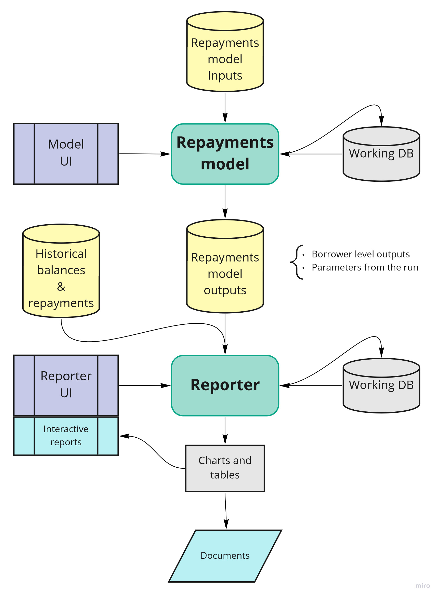

# Practical guidance on how to implement a re-platform{#practical}

Once you have determined that your model should be ported into a code-based format there are a number of things you should plan and consider as you start to scope your project.  We'll provide some general guidance here with further practical tips in the [case studies](#case_studies) section.

## Pre-requisites

To ensure a successful outcome it’s essential that several areas are addressed before re-platforming begins.  Perhaps most importantly, you will need **buy-in from stakeholders**.  [This](#stakeholders) section includes some of the most commonly asked questions from Stakeholders and as this could be one of the most difficult challenges, engaging with them early is likely to be beneficial.  

Ahead of carrying out any re-platforming, you should identify who your **end users** are.  Are they analysts, managers, policy stakeholders or a combination of those?The answer to this question might influence the language you decide to use and the type of output(s) you decide to create.  Thinking about this before you start your re-platforming will help you to shape the redevelopment in the best way.  It should be one of the first steps of your planning as the answer will impact your requirements, which will in turn feed into your resource and skill requirements.  

Once you have secured Stakeholder buy-in and identified your end-users, ensuring there is sufficient time and appropriate resource dedicated to the project is vital. As with any piece of analysis, a rushed job is more likely to be a poor job. This could mean postponing Business As Usual work, existing model updates and/or securing additional resource.  But, however tempting it might be to 'contract out' the re-platforming to experts who then hand 'it' over, this is *not* recommended as without _a lot_ of collaboration, you're likely to end up with a team who do not understand the model.  Therefore, the analysts who will carry out the re-platform need to have sufficient software knowledge for the chosen platform.  This might mean they need to undertake L&D activities are needed and/or engage with experts and relevant groups for advice and support (for example, the DfE Analyst Network Data Science channel or Python Team), particularly in the event that any difficulties are encountered. 

## Design choices

Choosing a **language** to re-platform into should be one of your earliest considerations after deciding to re-platform. You will need to choose a language that allow you to deliver the required outputs but also one with which your team have the skills to code in, or the ability to learn.  Within DfE, SQL is already well established, whilst R is becoming increasing popular and is very well supported with [Analytics Academy](https://educationgovuk.sharepoint.com/sites/sarpi/g/SitePages/Analytics-Academy.aspx) and a number of willing experts across the Department who regularly provide support and advice through the DfE Analyst Network.  Python may also be a consideration and whilst it is not (yet) as popular as R within DfE there is an active community and plenty of external resources online.

As with lots of code-based analysis, it is likely that the code **design** will evolve as the re-platform commences.  However, having a clear set of objectives and required outputs from the outset is critical to ensuring that the re-platformed model is fit for purpose. This will also help to avoid scope creep and reduce the likelihood of the re-platformed model becoming unnecessarily complex.

For **clarity** you will need to think carefully about how the re-platformed model will be structured so that it's efficient and follows best practice.  In fact, you may specifically want to avoid replicating the existing processes and mechanics of the non-code based model in order to improve the efficiency of the re-platformed model.

We've already covered the benefits of writing clear, well structured code [elsewhere](https://dfe-analytical-services.github.io/good-code-practice/fundamentals.html) and a re-platforming project is no different to any other code based project in that respect.  However, depending on the complexity of the model, in addition to ensuring that code is well structured, consistent and commented appropriately, it may also be beneficial to provide a schematic diagram of how the model works, such as the one below.  

As we'll cover shortly, well documented re-usable components will help to ensure that the code is clear and easy to follow.  This should ensure it's easy for others to pick up the model and update or develop it more readily in future as well as making the model as transparent as possible should you wish to go into more detail with stakeholders.

There is a strong likelihood that if you're undertaking a re-platforming project that the existing model may be repeating the same formulae or data processing numerous times.  Whilst you could write some code that mirrors those processes, writing (and clearly documenting) bespoke functions will help to achieve reduced run-times and the flexibility to run a greater range of scenarios and/or uncertainty testing.

Whether the existing model takes account of uncertainty or not, we would also strongly advise you to think about building-in uncertainty (where appropriate) when you re-platform a model. There are various techniques to consider and some of these are covered in more detail as part of the [Uncertainty Toolkit for Analysts in Government](https://analystsuncertaintytoolkit.github.io/UncertaintyWeb/chapter_3.html).  

## Testing and Version Control

There is more information about how to conduct **testing** in the [DfE Good Code Practice](https://dfe-analytical-services.github.io/good-code-practice/testing.html) but in addition to unit testing, we would recommend ensuring that the re-platformed model outputs match the previous model before you start developing the model further.  Ensuring that the re-platformed model can produce equivalent or comparable outputs to the previous model will give stakeholders confidence in the re-platformed model as you will be able to demonstrate that the re-platformed model can reproduce the existing model.

As we've covered [elsewhere](https://dfe-analytical-services.github.io/good-code-practice/VC.html), **version control** is a really important aspect of any coding project but it particularly adds value when teams are working collaboratively.  Using Git is far superior to keeping local scripts and manually amending file names and there is unlikely to be a better time to embed Git into your ways of working than when you move away from Excel to re-platform a model.  In DfE, repos within Azure DevOps are the existing code version control tool of choice and there are several resources, including how to access and use DevOps, listed in the [Further Reading](#further_reading) section.

Whatever the Version Control tool used, it is advisable to create a repository for the project and for all collaborators to use the repo to manage their code.  An ideal workflow is where the analyst creates a *pull request* (AKA *merge request* in GitLab) to merge their code changes into a clean master version of the code and the approver (quality assurer or designated collaborators) then evaluates whether the change is appropriate and either approves or asks for edits to be made.  

Within Azure DevOps repos, you can [set branch policies](https://docs.microsoft.com/en-us/azure/devops/repos/git/branch-policies?view=azure-devops) such as a setting minimum number of reviewers and/or automatically including code reviews.  

Once the re-platformed model is in use, new branches should be created to develop features or changes and then these should be merged back into the master branch with a pull (merge) request to seek approval from the appropriate person.

## Documentation and Outputs

As with any model, good **documentation** is a key part of knowledge management; particularly to ensure that other colleagues can understand, use and update the model and so that any data and/or assumptions are recorded clearly.  **QA reports** can also be automatically generated so these should be a key consideration when thinking about outputs too, for example producing basic summary statistics, a list of checks or unit tests that have been carried out or showing totals through various steps of a process.  There are various packages are available to produce documentation depending on the platform used and type of outputs needed.  

In R, Markdown can be used to create html **outputs** with dynamic visuals and code snippets and this can be taken one step further and published via Bookdown.  This is often done to produce reports or guidance once the code has been completed as separate .Rmd scripts will be needed which means that if you make changes to R scripts you may also need to duplicate these in .Rmd files for example.  

[ROxygen](https://cran.r-project.org/web/packages/roxygen2/vignettes/roxygen2.html) overcomes the above issue as you can comment scripts as you go along and produce outputs from the scripts.  It readily supports documentation for R packages so this may be useful if you are creating bespoke functions and/or packages.  If you need to present a lot of code and less text/explanation, you may also want to consider using the [Spin function within the Knitr package](https://deanattali.com/2015/03/24/knitrs-best-hidden-gem-spin/) or rendering directly from a script using the "compile notebook" button in R Studio.

When considering outputs, think about what your users need.  For example, an interactive dashboard output or RShiny App, such as [this](https://cars-dashboard-dwzndgiyya-ez.a.run.app/) one, would work well for scenario testing, whereas figures needed for a Business Case could be output to an Rmarkdown document or even a simple table or .csv file.  Whatever the final outputs are, you should also think about interim steps within your script as it's likely your users would previously have worked through a spreadsheet to look at parts of the calculation(s).  A comprehensive Rmarkdown with different sections replicating the Excel checkpoints would be a good way to demonstrate what your script is doing and give Stakeholders confidence in the model. 

